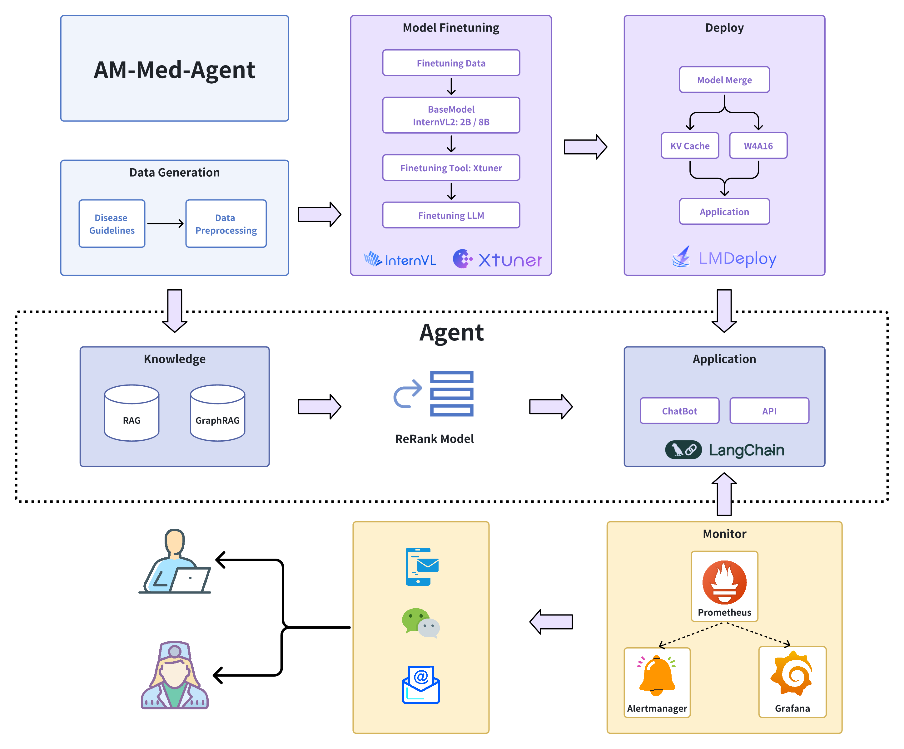

# AM-Med-Agent  

本项目依托：[InternLM](https://github.com/InternLM/Tutorial)  

## 项目背景
### 随访介绍
随访指医院对曾在医院就诊的患者，在特定时间后的状况进行跟踪和评估的过程。

随访的目的通常包括：

1. **评估治疗效果**：监测患者治疗后的健康状态，评估治疗效果是否达到预期目标。
2. **监测疾病进展**：对于慢性疾病或长期健康问题，随访可以帮助了解疾病的发展趋势。
3. **早期发现复发或并发症**：对于某些疾病，随访可以及时发现疾病复发或新出现的并发症。
4. **收集数据**：在临床研究中，随访是收集长期数据的重要手段，有助于研究疾病的发展规律和治疗效果。

### 现今随访的痛点
对于大型公立医院而言，由于医疗资源的紧张，患者往往在手术后不久，大约一周左右，就需要安排出院。患者出院后，医生和护士很难有足够的时间和精力去跟踪患者出院后的病情变化。

对于私立医疗机构，虽然诊后也会通过电话或微信的方式询问康复情况，但大多还是停留在提高服务质量上，对病情的跟踪较少。

## 项目意义
借助智能随访 Agent，有助于实现首诊到诊，复诊线上化，这在一定程度上有助于缓解医疗资源的紧张状况。此外，智能随访 Agent 能够提醒患者严格遵守医嘱，确保按时服药，从而增强患者的用药依从性，并提升整体的治疗效果。

## 项目核心功能
1. **用药指导服务**：当患者出现感冒发烧症状，面对家庭药箱中的备用药品感到迷茫时，Agent 将提供专业的用药指导，确保患者能够正确、安全地使用药物。
2. **医嘱助手功能**：依据医生开具的医嘱，Agent 将主动与患者沟通，提醒其按时服药，从而提高患者的用药依从性，确保治疗效果。
3. **线上健康咨询**：即使在遵循医嘱的基础上，患者可能对某些食物是否适宜食用仍有疑问。Agent 将依据电子病历和最新的医学文献，为患者提供针对性的饮食建议，帮助其在治疗期间做出正确的饮食选择。
4. **智能随访系统**：Agent 将综合考量患者的病史、并发症、近期服药记录以及日常健康数据，结合最新的医学指南，智能判断患者是否需要进行线下复诊复查，以保障患者的健康状态得到及时的监控和必要的医疗干预。
5. **输出监控与干预机制**：平台对 Agent 的输出内容实施严格监控。一旦发现 Agent 提供任何不恰当或不准确的医疗建议，系统将立即通知相关系统人员或医疗专业人员进行人工审核和干预，确保患者接收到的信息既安全又可靠。

## 技术架构图




## 数据集

- [ShenNong_TCM_Dataset](https://huggingface.co/datasets/michaelwzhu/ShenNong_TCM_Dataset)
- [中文医疗对话数据集](https://tianchi.aliyun.com/dataset/90163)
- [面向家庭常见疾病的知识图谱](http://data.openkg.cn/dataset/medicalgraph#)
- [中药说明书实体识别](https://tianchi.aliyun.com/dataset/86819)

## 部署说明

### 用药指导指令微调

```bash
# 模型准备
# 软链接
ln -s /root/share/new_models/Shanghai_AI_Laboratory/internlm2_5-7b-chat /root/home/AM-Med-Agent/model/internlm2_5-7b-chat

mkdir /root/home/AM-Med-Agent/work_dir
mkdir /root/home/AM-Med-Agent/work_dir/medical_finetune

# 指令微调
cd /root/home/AM-Med-Agent
conda activate xtuner-env
xtuner train ./config/internlm2_5_chat_7b_qlora_alpaca_e3.py --deepspeed deepspeed_zero2 --work-dir ./work_dir/medical_finetune
```
- `xtuner train` 命令用于启动模型微调进程。该命令需要一个参数：CONFIG 用于指定微调配置文件
- 训练过程中产生的所有文件，包括日志、配置文件、检查点文件、微调后的模型等，默认保存在 `work_dir` 目录下
- `--deepspeed deepspeed_zero2` 参数用于指定使用 DeepSpeed 进行模型训练，并启用 ZeRO-2 优化策略